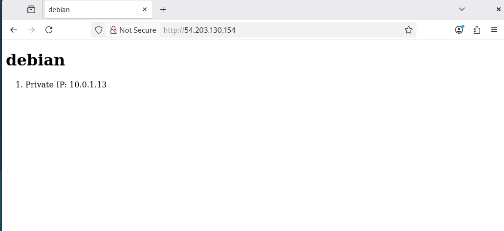

# In-Class Lab Week 10

## Server Setup Screenshot




## Running the Ansible Configuration,
Prerequisites,
Terraform applied (terraform apply from the terraform/ directory),
Key pair aws-4640 imported into AWS,

### Run the Playbook
```bash
cd ansible
ansible-playbook -i inventory/aws_ec2.yml playbook.yml
